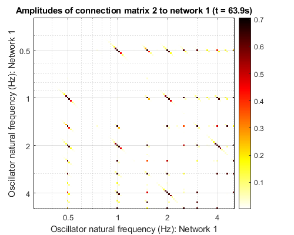

<!-- README.md is generated from README.Rmd. Please edit that file -->

# Single-Layer Gradient-Frequency Neural Network with Hebbian Learning

<!-- badges: start -->

<!-- badges: end -->

This is a MATLAB implementation of a single-layer gradient-frequency
neural network based off of Tichko & Large (2019)
(<https://doi.org/10.1111/nyas.14050>), who simulated infants’
perceptual narrowing to musical rhythm (e.g., Hannon & Trehub, 2005a,b).
The model requires the gradient-frequency neural network (GrFNN) library
for MATLAB (<https://github.com/MusicDynamicsLab/GrFNNToolbox>).

## The Model

The main MATLAB script that runs the model is experimentRhythms\_Main.m.
The parameters of the network and learning rule are under “Model
Parameters.” These sets of parameters are a good starting place to begin
building a network with Hebbian plasticity. Parameters for the
simulation can be found under “Misc Parameters,” where, importantly,
numTrain is the number of training trials (i.e., loops) to train the
network on.

## Rhythmic Stimuli

You can train the network on an isochronous-metered rhythm (4/4/ time)
or a non-isochronous-metered rhythm (7/8 time) by commenting in/out the
lines of code that use the GrFNN library to create a rhythmic stimulus
from a MIDI file:

s = stimulusMake(1, ‘mid’, ‘Iso\_2\_1\_Original\_120BBPM\_32cycles.mid’,
‘display’, 1); % Western training rhythm %s = stimulusMake(1, ‘mid’,
‘NonIso\_3\_2\_Original\_120BPM\_32cycles.mid’, ‘display’, 1); %
Balkan training rhythm

## Model Output

Running the script will begin the simulation and train the network. The
output is set to display oscillator amplitudes, the rhythmic stimulus in
the time domain, and the connection matrix of the neural network. Here
are some examples of the output at the end of training:

These are the oscillator amplitudes after training the network on an
isochronous-metered rhythm with a fast learning
rate:

This is the connection matrix of the network after training the network
on an isochronous-metered rhythm with a fast learning rate. Lots of
learning\!

